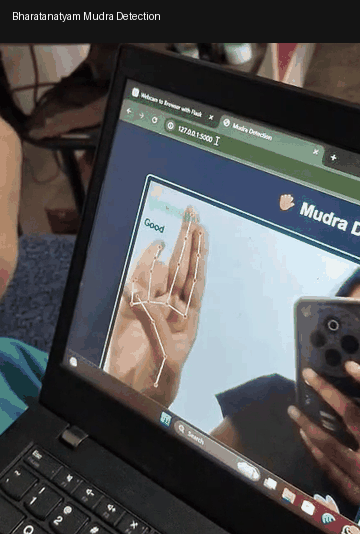

# Bharatanatyam Mudra Detection

## About the Project

Bharatanatyam Mudra Detection is an AI-based project developed by a team of four members as part of our final-year project.

The main aim of this project is to identify different Bharatanatyam hand mudras using computer vision and machine learning techniques. The system is designed to detect mudras in real time using a webcam and provide basic correction feedback to help users improve their hand gestures.

## Technologies Used

- Python
- TensorFlow
- Keras
- MediaPipe
- OpenCV
- Flask
- HTML

## How It Works

The system captures live hand gestures using a webcam. MediaPipe is used to detect 21 hand landmarks from the user's hand.

Each landmark contains x, y, and z coordinates. These 21 landmarks are converted into a 63-dimensional feature vector.

The feature vector is then given to a Neural Network model trained to classify different Bharatanatyam mudras.

During real-time detection, the predicted mudra and confidence score are displayed on the screen. The system also provides basic correction feedback based on finger positions.

## Dataset

The dataset contains images of different Bharatanatyam mudra classes.

The images were collected and processed as part of the project. The dataset was cleaned by removing empty and corrupted images, and the valid images were organized according to their mudra classes.

The dataset was divided into training and validation sets. MediaPipe was then used to extract 21 hand landmarks from the images.

The extracted landmarks were converted into 63 numerical features and saved as NumPy files for model training.

## Model

A Neural Network model is used to classify different Bharatanatyam mudra classes.

The model takes a 63-dimensional feature vector as input. These features represent the x, y, and z coordinates of the 21 hand landmarks detected using MediaPipe.

The model uses hidden layers with non-linear activation functions such as ReLU. The final output layer uses softmax activation to produce prediction probabilities for the different mudra classes.

The model is trained using categorical cross-entropy loss.

The trained model is used during real-time detection to predict the mudra from the extracted hand landmark features.

## Project Structure

Mudra-Detection/
│
├── Small data traing/
│   ├── train/
│   ├── val/
│   └── app.py
│
├── landmark_model/
├── mudra_clean/
├── check.py
├── mudra_log.csv
├── mudra_model.h5
└── README.md

## Real-Time Detection

The application uses a webcam to capture live hand gestures.

The detection process follows these steps:

1. Capture live video using the webcam
2. Detect the hand using MediaPipe
3. Extract 21 hand landmarks
4. Convert the landmarks into 63 features
5. Pass the features to the trained Neural Network
6. Predict the mudra class
7. Display the predicted mudra and confidence score
8. Provide basic correction feedback

## Correction Feedback

The system includes a simple rule-based correction mechanism.

It checks finger positions using the extracted hand landmarks and compares them with predefined rules for different mudras.

Based on the detected finger positions, the system provides basic feedback to help the user understand and correct their hand gesture.

## How to Run

Python 3.10 is recommended for running this project.

Open PowerShell and move to the project folder:

cd "D:\The_Correction_3rd - timestamp"

Set the protobuf environment variable:

$env:PROTOCOL_BUFFERS_PYTHON_IMPLEMENTATION="python"

Run the application:

py -3.10 "Small data traing\app.py"

## Project Features

- Real-time Bharatanatyam mudra detection
- Webcam-based hand gesture recognition
- MediaPipe hand landmark detection
- 21 hand landmark extraction
- 63-dimensional feature representation
- Neural Network based mudra classification
- Confidence score display
- Basic gesture correction feedback
- Python and Flask based application

## My Contribution

This was a team project developed by four members as part of our final-year project.

My main contribution was working on the database part of the project. I worked on creating and managing database tables, storing mudra details and results, and connecting the database with the application. I also supported testing and debugging.

## What We Learned

Through this project, our team gained practical experience in:

- Python programming
- Computer vision
- MediaPipe hand landmark detection
- TensorFlow and Keras
- Neural Network model training
- Data preprocessing
- Real-time webcam processing
- Database management
- Flask-based application development
- Testing and debugging

## Future Improvements

Some possible improvements for the project include:

- Adding more diverse mudra samples
- Improving model performance under different lighting conditions
- Improving detection when the hand is partially occluded
- Supporting more complex or dynamic gestures
- Improving the correction feedback
- Developing a mobile or augmented reality version

## Team

This project was developed by a team of four members as part of our final-year project.

- Bhuvaneshwari R
- Daniyel Raja V
- Nanthana K
- Gobinath S

## Author

Gobinath S

Computer Science and Engineering

## Demo

